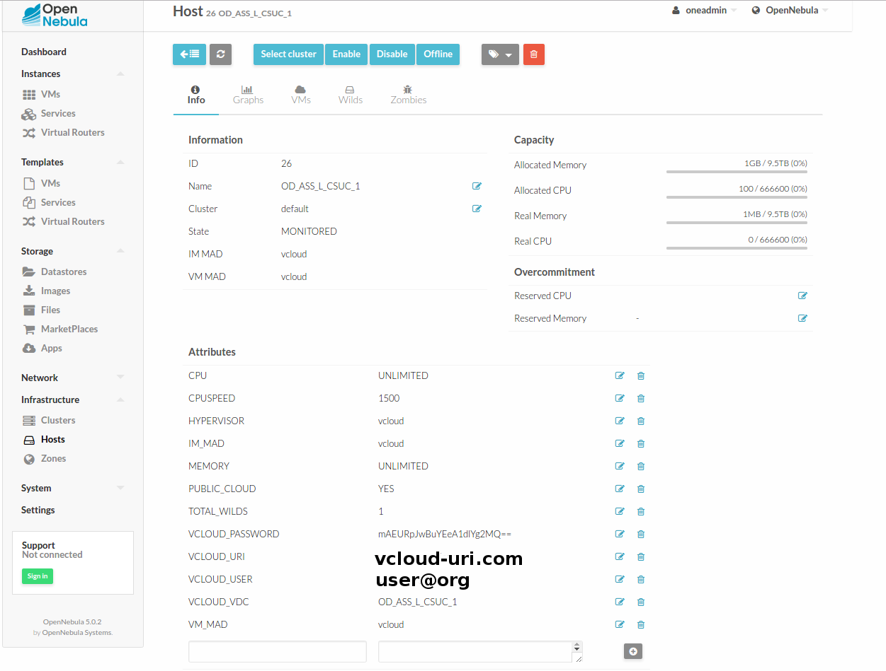
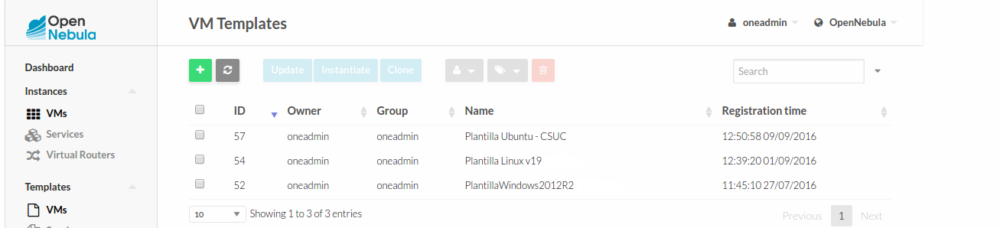
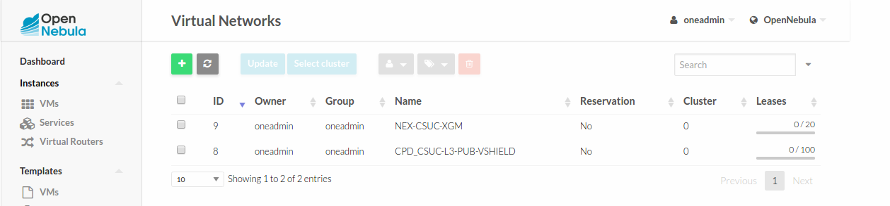
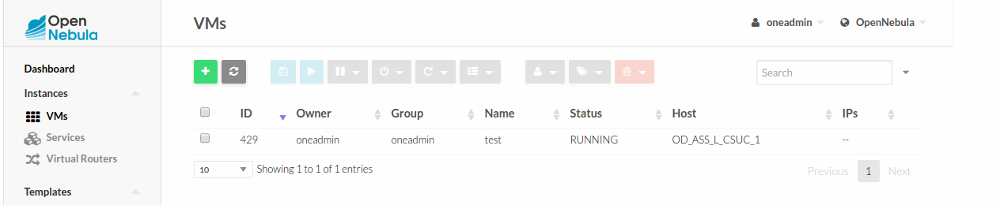
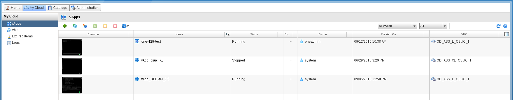

# VCLOUD DRIVER. Installation and Configuration Guide

# TABLE OF CONTENTS

* Install OpenNebula
* Install vCloud Driver
    * Download and copy files
    * Change permissions and owner
    * Modify /etc/one/oned.conf
    * Restart OpenNebula service
* Install 'ruby_vcloud_sdk-0.7.5
    * Install dependencies
    * Install gem
* Import hosts,templates,networks,datastores
* Usage
* FAQ

# INSTALL OPENNEBULA

[http://docs.opennebula.org/5.0/deployment/opennebula_installation/index.html](http://docs.opennebula.org/5.0/deployment/opennebula_installation/index.html)

# INSTALL VCLOUD DRIVER FOR OPENNEBULA (IN THE FRONTEND)

### 1.Download and copy the files in their respective directories:

    - 5.0/remotes/vmm/vcloud 				  	-> /var/lib/one/remotes/vmm/
    - 5.0/remotes/im/vloud.d 					-> /var/lib/one/remotes/im/
    - 5.0/remotes/datastore/vcloud 				-> /var/lib/one/datastore
    - 5.0/remotes/vmm/vcloud/vcloud_driver.rb 	-> /usr/lib/one/ruby

### 2.Change permissions and owner:

 	 chown -R oneadmin:oneadmin /var/lib/one/remotes/vmm/vcloud /var/lib/one/remotes/im/vcloud.d /var/lib/one/remotes/datastore/vcloud

 	 chmod -R +x /var/lib/one/remotes/vmm/vcloud /var/lib/one/remotes/im/vcloud.d /var/lib/one/remotes/datastore/vcloud

### 3.Modify the /etc/one/oned.conf configuration file adding the following new lines

* In IM_MAD section:
  
  		 #-------------------------------------------------------------------------------
   		 #  VMware vCloud Director Information Driver Manager Configuration
  		 #-------------------------------------------------------------------------------
		 IM_MAD = [
      		name       = "vcloud",
      		executable = "one_im_sh",
      		arguments  = "-c -t 15 -r 0 vcloud"]
   		#-------------------------------------------------------------------------------

* In VM_MAD section:

   		 #-------------------------------------------------------------------------------
    	 #  VMware vCloud Director Virtualization Driver Manager Configuration
    	 #-------------------------------------------------------------------------------
     	 VM_MAD = [
    		name       = "vcloud",
    		executable = "one_vmm_sh",
    		arguments  = "-p -t 15 -r 0 vcloud -s sh",
    		type       = "xml" ]
		#------------------------------------------------------------------------------

* In TM_MAD section:

		We need to add vcloud as a argument.This section must be like this:
    
    	TM_MAD = [
    		executable = "one_tm",
    		arguments = "-t 15 -d dummy,lvm,shared,vcloud,fs_lvm,qcow2,ssh,vmfs,ceph,dev"
		]

* In DS_MAD section:

		We need to add vcloud as a argument.This section must be like this:
    
   		DATASTORE_MAD = [
    		executable = "one_datastore",
    		arguments  = "-t 15 -d dummy,vcloud,fs,vmfs,lvm,ceph,dev"
		]
    

* Add the following lines at the end of the file in the Transfer Manager Driver Behavior Configuration section:

    	TM_MAD_CONF = [
    		name = "vcloud", ln_target = "NONE", clone_target = "NONE", shared = "yes"
		]

		DS_MAD_CONF = [
    		NAME = "vcloud", REQUIRED_ATTRS = "VCLOUD_HOST", PERSISTENT_ONLY = "YES",
    		MARKETPLACE_ACTIONS = "export"
		] 

### 4.Restart ONE service.

 	service opennebula restart

# INSTALL 'ruby_vcloud_sdk-0.7.5'

As a root:

### 1.Install dependencies

	apt-get install make g++ ruby-dev zlib1g-dev liblzma-dev 

### 2.Download and install the gem

	gem install ruby_vcloud_sdk-0.7.5.gem

# IMPORT HOSTS,TEMPLATES, NETWORKS AND DATASTORE USING ONEVCLOUD SCRIPT

When vCloud Driver is installed correctly, it's time to use onevcloud script to import the resources of vCloud.

	/var/lib/one/remotes/vmm/vcloud/onevcloud [hosts | templates | networks | datastores] --vcloud [vcloud-uri.com] --vuser [user@organization] --vpass [password] --vdc [VDC_name]

# USAGE

##The first step is import to OpenNebula the resources hosted in vCloud using the onevcloud script.

###Hosts

  /var/lib/one/remotes/vmm/vcloud/onevcloud hosts --vcloud [vcloud-uri.com] --vuser [user@organization] --vpass [password] --vdc [VDC_name]

###Templates

  /var/lib/one/remotes/vmm/vcloud/onevcloud hosts --vcloud [vcloud-uri.com] --vuser [user@organization] --vpass [password] --vdc [VDC_name]

###Networks

  /var/lib/one/remotes/vmm/vcloud/onevcloud networks --vcloud [vcloud-uri.com] --vuser [user@organization] --vpass [password] --vdc [VDC_name]

##Intanciate Templates

  When the resources are imported correctly, we can start to instanciate templates!

